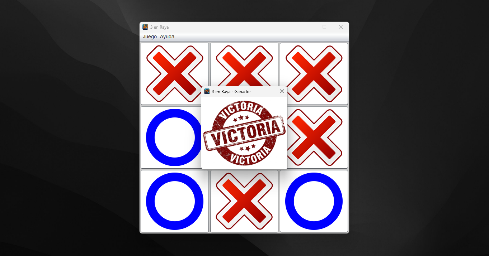

<div align="center">

# Juego 3 en Raya

*¿Serás capaz de conseguir la victoria antes que tu rival?*



</div>

## Acerca del Proyecto
Juego clásico de Tres en Raya desarrollado en Java utilizando Swing. El objetivo es enfrentar a dos jugadores en una partida estratégica donde deberán colocar sus símbolos en el tablero hasta conseguir una línea horizontal, vertical o diagonal.

## Características
- Modo de juego para dos jugadores.
- Registro de nombres de los participantes.
- Cambio automático de turnos.
- Detección automática de ganador.
- Detección de empate.
- Reinicio de partida.
- Tabla de resultados.

## Tecnologías Utilizadas
| Tecnología | Descripción |
|------------|-------------|
| `Java 8` | Lenguaje principal del proyecto |
| `Swing` | Desarrollo de la interfaz gráfica |
| `NetBeans` | Entorno de desarrollo |
| `Git` | Control de versiones |
| `GitHub` | Gestión y alojamiento del repositorio |


## Cómo Ejecutar

```bash
git clone https://github.com/JorgeCG26/java-juego-3-raya.git
```

Abrir el proyecto en **NetBeans** y ejecutar la aplicación.
